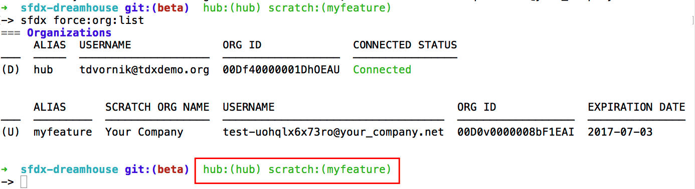

# Salesforce DX Tools

This is a collection of useful tools when using Salesforce DX and was presented at TrailheadDX: [Boost Developer Productivity with Salesforce DX CLI Customized Tools](https://www.youtube.com/watch?v=tO81C9IvQvc). *Note: There were technical difficulties so the video starts a few slides in.* The goal of the presentation is to inspire you to customize and create your own tools. The presentation starts simple and this repo contains an expansion of those same scripts and tools. I encourage you to do the same: start simple than expand. 

If you have tools you would love to share with the Salesforce DX community, feel free to do a PR against this repo and share it on Twitter using the #SalesforceDX hashtag. 

# Useful Scripts

These are specific for the shell (command line) to help create shortcuts or handy visuals.

*Note: Sorry Window users. All shell examples are in bash. I will work on bat files later.*

## Setup Scripts

The same set of commands is usually run to set up the scratch org for development or to run tests. In the video, I show the common commands around the [Dreamhouse app](https://github.com/forcedotcom/sfdx-dreamhouse). The [dreamhouse-setup.sh](./dreamhouse-setup.sh) shows a little extension of that where we validate the sfdx org alias name. I recommend creating your own setup script for your own flows.

## Shell Aliases

Bash aliases are a great way to simplify the commands you type the most. The [aliases](./aliases) script is a simple set of sfdx command aliases. The [aliases-extended.sh](./aliases-extended.sh) is a great way to generate an aliases list will all the commands in force, but you will still need to update XX with the characters you want. I also recommend making your own aliases of commands (including flags) that you type a lot. Also see [Running Bash Scripts on Shell Start](#running-bash-scripts-on-shell-start).

## Bash Prompt

I find myself constantly running `sfdx force:org:list` to see what my current default dev hub and username (usually a scratch org) is. Adding this to the prompt is a very useful, similar to showing the git branch on the prompt. Also see [Running Bash Scripts on Shell Start](#running-bash-scripts-on-shell-start).

## Running Bash Scripts on Shell Start

Running these bash scripts will only work for your current terminal instance. Add `source <path-to-script>` in your *$HOME/.bash_profile*, *$HOME/.bashrc*, *$HOME/.zshrc*, or whatever runs when your shell starts.

# Connecting to API in Apps

The Salesforce DX CLI is great for managing authentication to different orgs and provides great encapsulation of certain experiences or features. Although there are some more direct wrappings around different API endpoints, there may be times when connected to an API endpoint directly is required.

The [chatter-build-status.js](./chatter-build-status.js) is a great example of using the Salesforce DX CLI's authentication to connect to the API using a simple node application. I use [JSForce](https://jsforce.github.io/document/) as the API layer. The great thing about a CLI is it can be invoked any language, so I encourage you to build your own DX apps that quickly connect and make API calls as needed.

# VSCode extension

Instead of including all the VSCode extension code, you can find out how to generate it at the [hello world](https://code.visualstudio.com/docs/extensions/example-hello-world) tutorial. From there, I modified the activation point in the package.json and changed my extension.ts to look like [this](./vscodeExtension.ts).